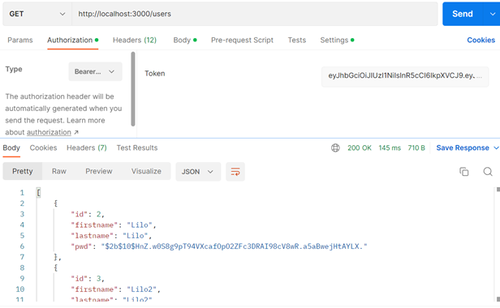
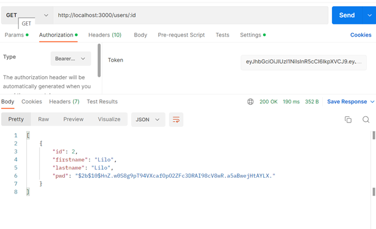
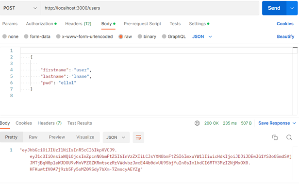
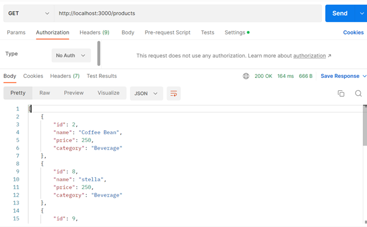
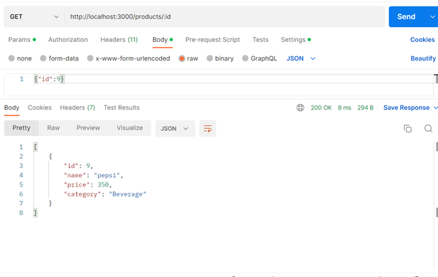
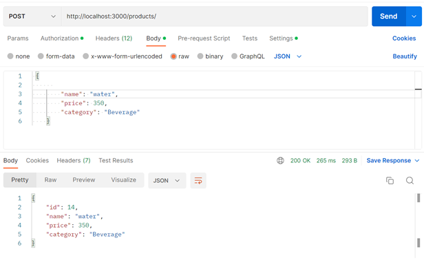
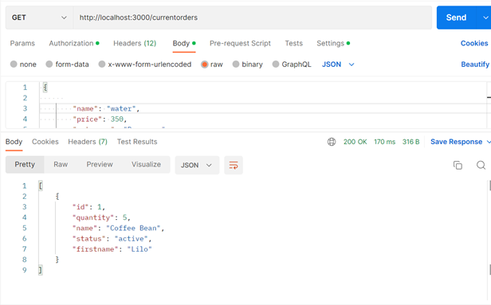

STOREFRONT  

ENVIRONMENT VARIABLES A

create an environemnt file  .env at the root of the project:

POSTGRES_HOST=127.0.0.1
POSTGRES_DB=store_db
POSTGRES_DB_TEST=store_db_test
POSTGRES_USER=postgres
POSTGRES_PASSWORD=*******
ENV =dev
BCRYPT_PASSWORD=your-secret-PASSWORD
SALT_ROUNDS=10
TOKEN_SECRET=******

# to test the app
npm run test 

# to run the app
 npm run start 

# Database setup

install postgres from (https://www.postgresql.org/download/)

set admin users and password 

run pgadmin tool and create db for test (POSTGRES_DB_TEST) and one for dev (POSTGRES_DB)

set default port to :5432

create database.ts file in main directory with the following code 

import dotenv from 'dotenv';
import { Pool } from 'pg';

dotenv.config();
const {
  POSTGRES_HOST,
  POSTGRES_DB,
  POSTGRES_DB_TEST,
  POSTGRES_USER,
  POSTGRES_PASSWORD,
  ENV
} = process.env;

let Client = new Pool();
console.log(ENV);

if (ENV === 'dev') {
  Client = new Pool({
    host: POSTGRES_HOST,
    database: POSTGRES_DB_TEST,
    user: POSTGRES_USER,
    password: POSTGRES_PASSWORD
  });
}

if (ENV === 'test') {
  Client = new Pool({
    host: POSTGRES_HOST,
    database: POSTGRES_DB,
    user: POSTGRES_USER,
    password: POSTGRES_PASSWORD
  });
}

export default Client;

yarn up - > will create db from migrations files

yarn start - > will run the app on localhost:3000

# APIs 

# you need to create user to generate token  , i created user method first then added token method to check the token

# for the users model

1- Index [token required]

2-Show [token required]

3- Create N[token required]

# products model

1-	Index

2-	Show 

3-	Create [token required]

# order model

1-	Current Order by user (args: user id)[token required]

